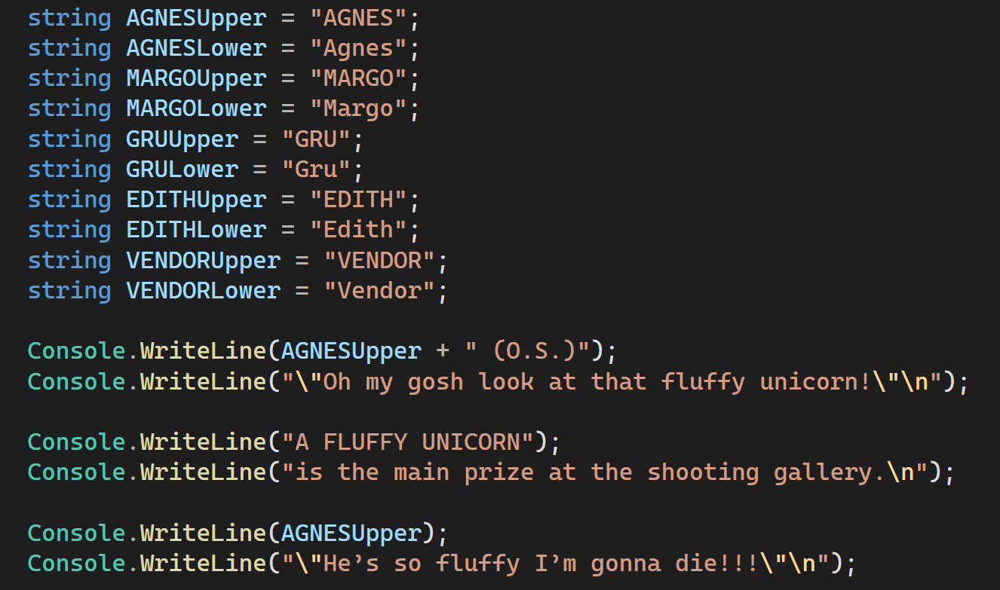

# Assignment - WriteLine() and Strings

# Assignment 1: Despicable Me Script Formatting

## Introduction

This assignment involves formatting a part of the "Despicable Me" script with specific guidelines. 

- Make seperate variables for upper and regular case version of the different names
    ```csharp
        string GRULower = "Gru";
        string GRUUpper = "GRU";
    ```
Do this for Gru, Agnes, Edith, Margo, and the Vendor

- When the character name is in all UPPERCASE and on its own line, you should use a variable to holds that name in all upper case.
    - Ex. 
    ```csharp
    Console.WriteLine(GRUUpper);
    Console.WriteLine("No, no, no.");
    ```
    Result
    ```console
    GRU
    No, No, No.
    ```

- When a name is in a sentence, like a quote or description, use the lower case variable of the name and concatenate it in.
    ```csharp
    Console.WriteLine(GRUUpper);
    Console.WriteLine("Ok, my turn");
    Console.WriteLine( GRULower + " calmly reaches into his coat and pulls out a small gun that transforms into an enormous RAY GUN. BLAM!");
    ```
    Result
    ```console
    GRU
    "Ok, my turn."
    Gru calmly reaches into his coat and pulls out a small gun that transforms into an enormous RAY GUN. BLAM!
    ```


- Use the escape characters to format your dialogue.
    - **\n** to go to a new line at the end of each dialogue.
    - **\\"** to display double quotes inbetween your first set of double quotes
    - These have to be used in double quotes
    
    ```csharp
    Console.WriteLine("He said \"What??!\"\n");
    Console.WriteLine("And I said \"I Know!\"");
    ```
    ```console
    He said "What??!"

    And I said "I Know!"
    ```

- Copy and paste the script for convenience, focusing on practicing string variables, concatenation, and output formatting (like Console.WriteLine()).

- Plan your approach by commenting out the script, creating variables, then assembling the script in code, emphasizing organization.

---

### Skills Required
- Understanding of variable declaration and usage
- Knowledge of string operations and concatenation
- Familiarity with output formatting in a programming environment
- Ability to read and follow script formatting guidelines
- Basic understanding of commenting code for clarity

### Guided Assignment 1 - 5 skills are required for this homework.

## Script for Formatting


### AGNES (O.S.)
_"Oh my gosh look at that fluffy unicorn!"_

### A FLUFFY UNICORN
_is the main prize at the shooting gallery._

### AGNES
_"He’s so fluffy I’m gonna die!!!"_

### MARGO
_"You gotta let us play for it."_

### GRU
_"No, no, no."_

### AGNES
_"Come on!"_

**Gru** sighs and addresses the slimy VENDOR.

### GRU
_"How much for the fluffy unicorn?"_

### VENDOR
(chuckles) _"Well...it is not for sale. But all you gotta do to win it is knock down that little spaceship there."_

The vendor points to the smallest of the spaceship targets.

### VENDOR
_"It’s easy!"_

**Gru** nods. He slaps a dollar bill on the table. The vendor slurps on his drink, and presses a button that opens the curtains and readies the cork guns.

### AGNES
_"Yay!"_

They take aim and open fire! POP! POP! POP! They all miss.

### AGNES
_"Again!"_

### MARGO
_"Wait!"_

### EDITH
_"Ah come on. One more time."_

### AGNES
_"Just one more! I accidentally closed my eyes!"_

**Gru** slaps down another bill. POP! POP! POP! This time **Agnes's** cork hits the target.

### AGNES
_"I hit it, I hit it! Did you see that? I hit it!"_

The video sign above the game reads: _“YOU LOSE.”_ **Gru** reacts.

### EDITH
_"Awww."_

### GRU
_"Whoa, whoa, whoa...What was that? She hit that! I saw that with my own eyes!"_

The Vendor gives **Gru** a smarmy smile. He flips through a stack of dollar bills.

### VENDOR
_"Hey, buddy. Let me explain something to you."_

The vendor points to the back of the range.

### VENDOR
_"Ya see that little tin spaceship? You see how it’s not knocked over? Do you know what that means, professor?"_

The vendor leans over the counter and gets right in **Gru’s** face.

### VENDOR
_"It means you DON’T GET THE UNICORN! Someone’s got a frowny face. Better luck next time!"_

**Gru** stares at the vendor, his blood beginning to boil. He remains calm and smiles at the vendor.

### GRU
_"Okay, my turn."_

**Gru** calmly reaches into his coat and pulls out a small gun that transforms into an enormous RAY GUN. BLAM! A bright blue RAY BLAST connects with the back of the shooting range, leaving no sign of the targets just a giant gaping hole. **Gru** turns to the vendor.

### GRU
_"Knocked over."_

The vendor trembles, silenced. **Gru** pockets his weapon and grabs the unicorn. He hands it to 

### AGNES, MARGO, and EDITH
cheer and AGNES hugs the animal tightly.

### AGNES
_"IT’S SO FLUFFY!"_

### MARGO
_"That was awesome!"_

### EDITH
_"You blew up the whole thing!"_

### AGNES
_"Let’s go destroy another game!"_

And then it happens: actually connecting with the girls and enjoying being with them, **Gru** allows a small smile to creep across his face.


---

### Example



```console
AGNES (O.S.)
"Oh my gosh look at that fluffy unicorn!"

A FLUFFY UNICORN
is the main prize at the shooting gallery.

AGNES
"He's so fluffy I'm gonna die!!!"
```

## Rubric

| Criteria                              | Description                                                                                   | Points |
|---------------------------------------|-----------------------------------------------------------------------------------------------|--------|
| Correct Implementation of String Variables | Proper use of variables for character names and dialogue                                       | 15     |
| Concatenation and Variable Integration | Accurate merging of strings and variables in the script                                        | 15     |
| Proper Formatting                      | Correct formatting with names in uppercase, dialogue in blue, and appropriate spacing         | 15     |
| Code Organization and Comments         | Well-organized code with clear comments for understanding                                      | 15     |
| Accuracy and Completeness             | Script completeness and alignment with the provided example                                    | 15     |
| Code Identification                    | Inclusion of the coder's name as a comment in the script                                        | 10     |
| Error-Free Code                        | The code runs smoothly without any errors                                                      | 15     |
